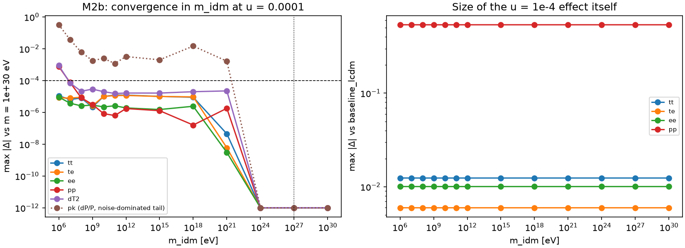

# Results summary

*Current state of the project. Rewritten in place as results change; the history is in [`experiment_log/`](experiment_log/). Last updated 2026-09-25.*

## Headline

**No science results yet.** The validation milestones M0–M2b are complete. The pipeline reproduces ΛCDM to better than 10⁻⁴ when all dark matter is replaced by zero-coupling interacting dark matter, and the clump mass has been shown to drop out of the calculation. The first physics results come from M3 (the u scan at f_cl = 1).

## Status of milestones and validation gates

| Milestone | Status | Key number | Record |
|---|---|---|---|
| M0 environment | ✅ done | CLASS v3.4.0 @ `64bbab7`, classy built, idm parameters accepted | [log](experiment_log/2026-09-25_m0_environment.md) |
| M1 baseline | ✅ done | h = 0.6738, σ₈ = 0.8107 | [log](experiment_log/2026-09-25_m1_baseline.md) |
| M2a u = 0 reproduces CDM | ✅ **pass** | max residual 4.1×10⁻⁵ (tolerance 10⁻⁴) | [log](experiment_log/2026-09-25_m2a_zero_coupling.md) |
| M2b cold-mass limit | ✅ **pass** | converged from m_idm ≈ 10⁷–10⁸ eV; bit-identical ≥ 10²⁴ eV; default 10²⁷ eV | [log](experiment_log/2026-09-25_m2b_mass_convergence.md) |
| M2c reproduce published bound | ⏳ pending (scheduled at M7) | target u < 2.25×10⁻⁴ | — |
| M3 – M11 | ⏳ not started | | |

| Experiment | Status |
|---|---|
| A: Thomson-like clumps | validation complete; scan (M3) next |
| B: opaque-clump kernel | not started |
| C: partial fraction | not started |
| D: formation history | not started |

## Validation results

### M2a: species substitution (f_cl = 1, u = 0 vs ΛCDM)

Maximum |residual| over 2 ≤ ℓ ≤ 2500 and 10⁻⁴ ≤ k ≤ 10 h/Mpc (TE relative to √(TT·EE)):

| TT | TE | EE | φφ | P(k) |
|---:|---:|---:|---:|---:|
| 1.9×10⁻⁵ | 1.2×10⁻⁵ | 8.3×10⁻⁶ | 1.9×10⁻⁶ | 4.1×10⁻⁵ |

Passing required two non-default CLASS precision settings. At default precision the discrepancy was up to 2×10⁻³, caused entirely by numerics:
1. a 4× finer thermodynamics table (default-precision CLASS is only good to ~10⁻³ against changes in thermodynamics sampling);
2. starting the perturbations 10× earlier, which suppresses a spurious decaying velocity mode seeded by CLASS's θ_idm = θ_γ initial condition.

*Assumptions:* fixed baseline cosmology, synchronous gauge, CLASS v3.4.0.

### M2b: cold-mass limit (u = 10⁻⁴, f_cl = 1)

- CMB spectra are independent of `m_idm` to within the numerical noise floor (~10⁻⁵) from 10⁶ eV upwards.
- φφ and P(k) (measured as ΔT² = ΔP/P_ΛCDM) converge from ~10⁷–10⁸ eV.
- From 10²⁴ eV the output is bit-identical, so the mass drops out exactly. The project uses **m_idm = 10²⁷ eV**.

## Incidental observations (to be superseded by M3)

At u = 10⁻⁴, f_cl = 1 and fixed cosmology, the deviations from ΛCDM are:

| Spectrum | Max deviation |
|---|---|
| TT | 1.2% |
| EE | 1.0% |
| TE | 0.6% |
| φφ | 16% at L = 1000, 54% at L = 2500 |
| P(k) | almost fully suppressed at k ≈ 10 h/Mpc |

This is consistent with u ~ 10⁻⁴ being near the published CMB bound. It is not yet a likelihood statement.
