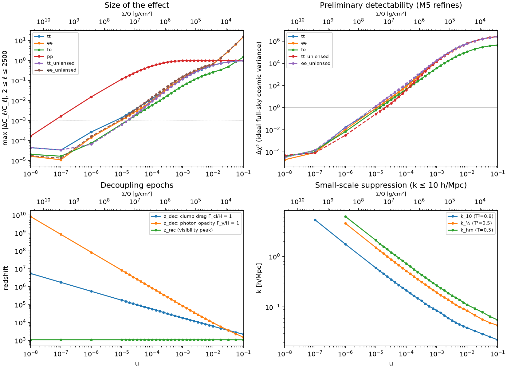
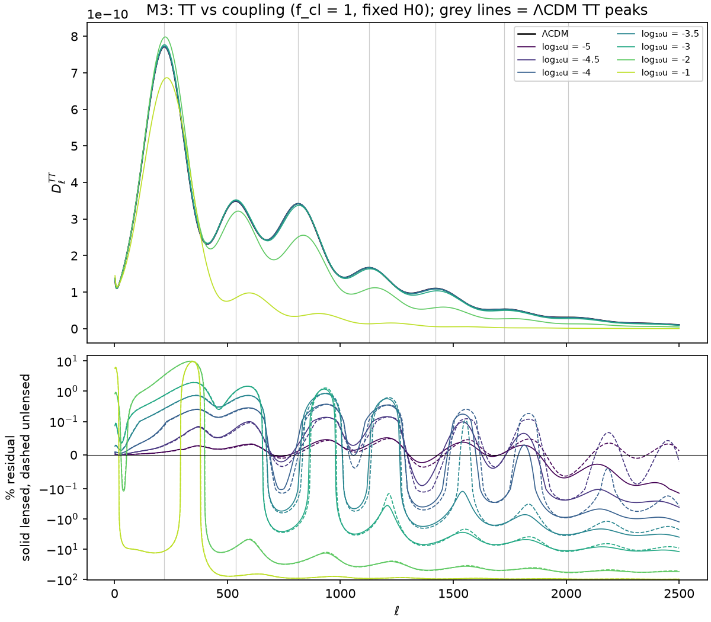
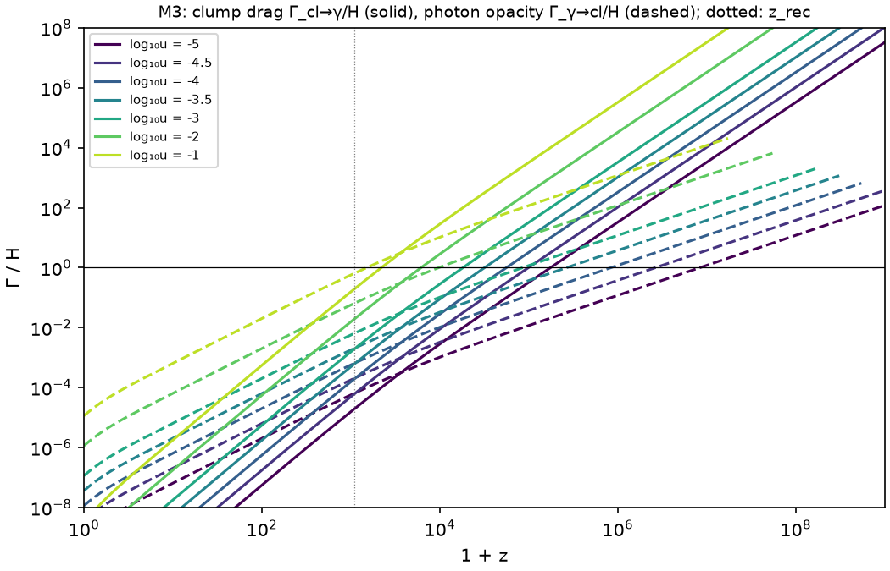
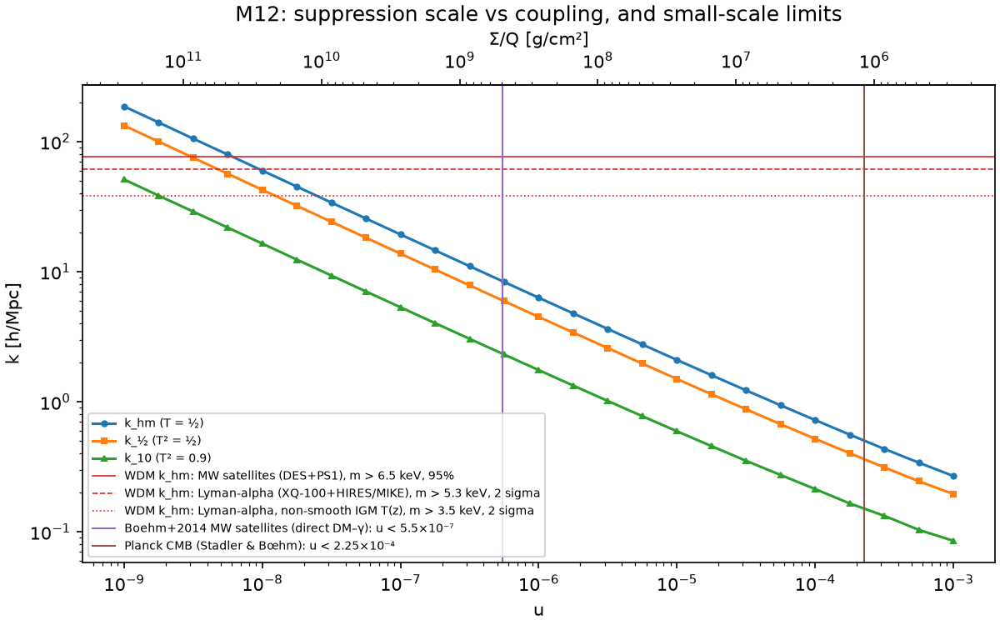
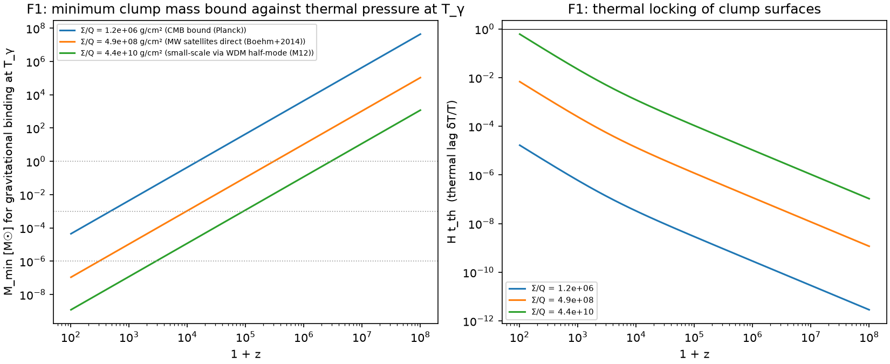
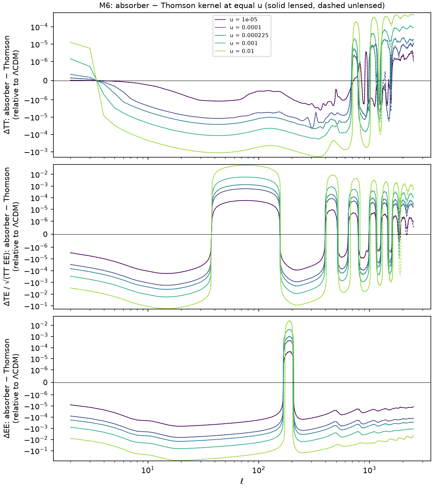
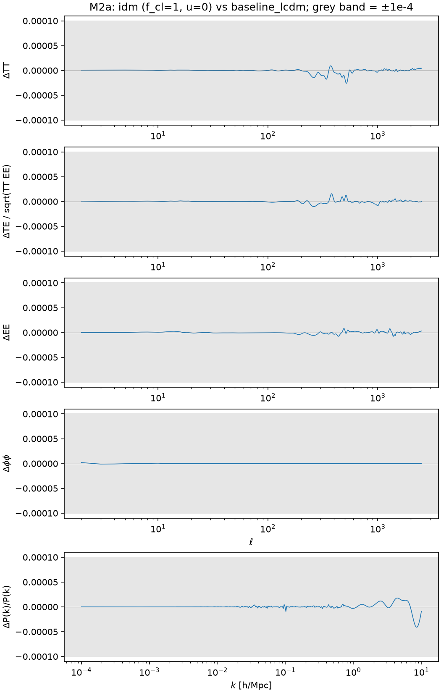

# Results summary

*Current state of the project. Rewritten in place as results change; the history is in [`experiment_log/`](experiment_log/). Last updated 2026-09-26.*

## Headline

**Most important finding so far (M13, F1; order of magnitude):** opaque baryonic clumps are thermally locked to the CMB temperature at every relevant epoch. Heated to T_γ, a clump is gravitationally bound only above a minimum mass: M ≳ (kT_γ/Gμm_p)²/(πΣ), or, for internal density ρ, below a survival redshift. Earth-mass clumps at ~1 g/cm³ can be bound only at z ≲ 450, i.e. after recombination; Jupiter-mass ones at z ≲ 4.5×10⁴. **Planetary-mass baryonic clumps therefore cannot be in place during the acoustic epoch**, which both the CMB and small-scale bounds assume (z ~ 4×10⁴ and ~10⁷ respectively). Clumps that are present then must be ≳ stellar mass or degenerate. This questions the premise of Experiments A–E for planetary-mass clumps and makes the formation history (D) the central open question. See [the M13 log](experiment_log/2026-09-26_m13_energy_exchange.md).

**Experiment A (Thomson-like clumps, stock CLASS), with fixed cosmology and no real data yet:**

- **With all dark matter in clumps (f_cl = 1), the CMB becomes sensitive at u ~ 10⁻⁵**, i.e. σ/M ~ 4×10⁻⁸ cm²/g or Σ/Q ~ 2×10⁷ g/cm², *if* measurements were limited only by full-sky cosmic variance. Real noise, sky coverage and refitting the other parameters will weaken this. The published Planck bound, u < 2.25×10⁻⁴ (Σ/Q ≳ 1.2×10⁶ g/cm²), is about 20× weaker, which is as expected; reproducing it is M7.
- **The CMB signal comes almost entirely from radiation *dragging the clumps* before z ~ 10⁴–10⁵, not from photons scattering off clumps.** At CMB-relevant couplings the clumps contribute ≲10⁻⁴ of the Thomson opacity before recombination and an optical depth τ_cl ≲ 10⁻³ after it. The observable effects are suppressed clump perturbations on small scales, weaker potentials (damping-tail TT/EE) and much less lensing.
- **Experiment B (M6) confirms that the kernel doesn't matter for the constraint.** Replacing the Thomson clump kernel with a perfect absorber at equal momentum transfer leaves TT, φφ and P(k) unchanged (≤ 5×10⁻⁵ at the Planck bound). It changes the ideal-CV detectability of u by **< 1%**. The only kernel-dependent signal is polarization generated by the clumps: EE lower by up to 1.4% at the Planck bound for an absorber. So the Thomson-kernel CMB bound applies to opaque clumps, with Σ_min = Q·268/u_max (Q = 1 for an absorber or specular reflector, 13/9 for a Lambertian one). See [the M6 log](experiment_log/2026-09-26_m6_kernel_check.md).
- **Small-scale structure is ~10⁴ times more constraining than the CMB (M12, approximate).** Matching the drag-induced cutoff in P(k) to verified warm-dark-matter limits (Milky Way satellites: m_WDM > 6.5 keV) gives **u ≲ 5×10⁻⁹, i.e. Σ/Q ≳ 5×10¹⁰ g/cm²** at f_cl = 1, with a factor ~2 systematic in u. The only direct DM–photon small-scale analysis (Boehm+2014, older satellite data) gives u < 5.5×10⁻⁷. **Caveat:** these scales enter the horizon at z ~ 10⁷, so the bound applies only if the clumps already exist, with that Σ, at z ~ 10⁷. The formation history (Experiment D) decides whether it is relevant.

## Status of milestones and validation gates

| Milestone | Status | Key number | Record |
|---|---|---|---|
| M0 environment | ✅ | CLASS v3.4.0 @ `64bbab7` | [log](experiment_log/2026-09-25_m0_environment.md) |
| M1 baseline | ✅ | h = 0.6738, σ₈ = 0.8107 | [log](experiment_log/2026-09-25_m1_baseline.md) |
| M2a u = 0 reproduces CDM | ✅ **pass** | max residual 4.1×10⁻⁵ (tolerance 10⁻⁴); re-passed with `l_linstep = 20` | [log](experiment_log/2026-09-25_m2a_zero_coupling.md), [M3 log](experiment_log/2026-09-25_m3_m4_coupling_scan.md) |
| M2b cold-mass limit | ✅ **pass** | converged from ~10⁷ eV; default m_idm = 10²⁷ eV | [log](experiment_log/2026-09-25_m2b_mass_convergence.md) |
| M2c reproduce published bound | ⏳ pending (at M7) | target u < 2.25×10⁻⁴ | — |
| M3 coupling scan (f_cl = 1) | ✅ | ideal-CV onset u ≈ 1.1×10⁻⁵ | [log](experiment_log/2026-09-25_m3_m4_coupling_scan.md) |
| M4 physical mapping | ✅ | table below | [log](experiment_log/2026-09-25_m3_m4_coupling_scan.md) |
| M6 Experiment B, minimal | ✅ | patched CLASS bit-identical to stock for Thomson; absorber shifts the u threshold by < 1% | [log](experiment_log/2026-09-26_m6_kernel_check.md) |
| M12 Experiment E, small scales | ✅ | u ≲ 5×10⁻⁹ (Σ/Q ≳ 5×10¹⁰ g/cm²) via WDM half-mode matching; applies if clumps exist by z ~ 10⁷ | [log](experiment_log/2026-09-26_m12_small_scale.md) |
| M13 Experiment F, energy exchange | ✅ (estimates) | passive clumps: μ ~ 2×10⁻⁸, y ~ 3×10⁻⁹ (≪ FIRAS); no-go on a full Boltzmann treatment; **clump survival (F1) is the key result** | [log](experiment_log/2026-09-26_m13_energy_exchange.md) |
| M5, M7 – M11 | ⏳ not started | | |

| Experiment | Status |
|---|---|
| A: Thomson-like clumps | scan and mapping done; likelihood (M5, M7, M8) after E/F estimates |
| B: opaque-clump kernel | ✅ minimal check done (M6): the kernel changes the u threshold by < 1%; full B1–B3 programme not needed |
| C: partial fraction | not started |
| D: formation history | not started |
| E: small-scale structure | ✅ M12 approximate bound; f_cl < 1 pending (C) |
| F: energy exchange / spectral distortions | ✅ M13 estimates: distortions negligible for passive clumps; survival criterion is the key result |

Execution order (plan §15): M6 → M12 → M13 → M5 → M7 → M8 → M9 → M10 → M11.

## Experiment A: coupling scan at f_cl = 1 (fixed H0, fixed cosmology)

| | u | σ/M [cm²/g] | Σ/Q [g/cm²] | z_dec (drag) | max ΔTT | max ΔEE | max Δφφ | Δχ²_CV (TT) | σ₈ | k_½ [h/Mpc] | M_hm [M☉/h] |
|---|---:|---:|---:|---:|---:|---:|---:|---:|---:|---:|---:|
| ideal-CV threshold | 1.1×10⁻⁵ | 4.1×10⁻⁸ | 2.4×10⁷ | 1.7×10⁵ | 0.15% | 0.12% | 13% | 1 | 0.805 | 1.4 | 1.5×10¹² |
| | 10⁻⁴ | 3.7×10⁻⁷ | 2.7×10⁶ | 5.6×10⁴ | 1.2% | 1.0% | 54% | 94 | 0.770 | 0.52 | 3.0×10¹³ |
| Planck bound (literature) | 2.25×10⁻⁴ | 8.4×10⁻⁷ | 1.2×10⁶ | 3.8×10⁴ | 2.8% | 2.7% | 75% | 608 | 0.733 | 0.36 | 8.9×10¹³ |
| | 10⁻³ | 3.7×10⁻⁶ | 2.7×10⁵ | 1.8×10⁴ | 12% | 13% | 97% | 1.7×10⁴ | 0.606 | 0.20 | 5.9×10¹⁴ |

*Assumptions:*
- stock CLASS idm–photon model (Thomson-like kernel), f_cl = 1, all standard parameters fixed at the baseline (h fixed);
- "max" is over 2 ≤ ℓ ≤ 2500 (lensed);
- Δχ²_CV is ideal full-sky cosmic variance for a single spectrum, **not** a data constraint;
- M_hm is the linear half-mode mass (T = ½).

The full 33-point table is in [`results/scans/m3/summary.md`](../results/scans/m3/summary.md).

**How the spectra respond** (details in the log):
- The damping tail is suppressed and the low peaks slightly enhanced.
- The peaks shift slightly to higher ℓ (Δℓ ≈ 0.1–1.2 at u = 10⁻⁴).
- Lensing roughly doubles the TT signal at small u, while it partly cancels the EE signal.
- φφ is the most sensitive observable: 1% at u ≈ 6×10⁻⁷.
- With θ_s held fixed instead of H0, the inferred h hardly moves for u ≤ 10⁻³.

**Interaction rates.** Clump drag stays coupled until z_dec (Γ_cl/H = 1), long before recombination for all CMB-relevant u. The photon opacity Γ_γ/H at recombination is ~10⁻³.

## Experiment E: small-scale structure (M12)

| Constraint on u (f_cl = 1) | u_max | Σ/Q min [g/cm²] | Status |
|---|---:|---:|---|
| CMB anisotropies (Planck; Stadler & Bœhm) | 2.25×10⁻⁴ | 1.2×10⁶ | published; reproduction at M7 |
| MW satellites, direct DM–γ N-body (Boehm+2014) | 5.5×10⁻⁷ | 4.9×10⁸ | published, verified |
| Lyman-α (m_WDM > 3.5 keV, non-smooth IGM T(z)) via half-mode | 2.0–2.5×10⁻⁸ | 1.1–1.4×10¹⁰ | this work, approximate |
| Lyman-α (m_WDM > 5.3 keV) via half-mode | 7.2–9.6×10⁻⁹ | 2.8–3.7×10¹⁰ | this work, approximate |
| **MW satellites (m_WDM > 6.5 keV) via half-mode** | **4.4–6.1×10⁻⁹** | **4.4–6.1×10¹⁰** | this work, approximate |

- **Ranges:** each pair of values uses the Viel et al. (2005) fit for WDM first, then CLASS's own thermal-relic WDM.
- **Scaling:** k_hm ≈ 10^(−2.05) u^(−0.48) h/Mpc.
- **Validity:** the bounds assume clumps exist by z ~ 10⁷ and are lighter than ~3 M☉ (the fluid approximation). After decoupling the clumps are collisionless: σ/M ~ 10⁻¹¹ cm²/g, and the stopping time in interstellar gas is ~10¹⁹ yr.

## Experiment F: energy exchange and survival (M13)

- **Distortions (FIRAS: |μ| < 9×10⁻⁵, |y| < 1.5×10⁻⁵):**
  - Passive blackbody clumps give μ ≈ +1.6×10⁻⁸ and y ≈ +3×10⁻⁹, limited by the clumps' heat capacity and independent of u.
  - FIRAS limits internal luminosity to L/M ≲ 850 L☉/M☉.
  - A sustained clump–CMB temperature offset must satisfy |δ| ≲ 3.5×10⁻⁶ at the CMB-bound coupling (the limit scales as 1/u).
  - At u ≳ 10⁻⁴ clumps thermalise the spectrum above z ≈ 4×10⁵, partially erasing μ from other sources (a future-mission signature).
- **Survival** (the headline above): minimum bound mass at T_γ against surface density and redshift:

| z | Σ/Q = 1.2×10⁶ (CMB) | 4.9×10⁸ | 4.4×10¹⁰ (small scales) |
|---|---:|---:|---:|
| 10⁷ | 4×10⁵ M☉ | 1×10³ M☉ | 12 M☉ |
| 10⁵ | 44 M☉ | 0.11 M☉ | 1.2×10⁻³ M☉ |
| 4×10⁴ | 7 M☉ | 0.017 M☉ | 1.9×10⁻⁴ M☉ |
| 10⁴ | 0.44 M☉ | 1.1×10⁻³ M☉ | 1.2×10⁻⁵ M☉ |

## Experiment B: clump kernel (M6)

| u | max ΔTT | max ΔEE | Δχ²_CV of the absorber − Thomson difference (EE) | change in TT+TE+EE Δχ²_CV vs ΛCDM (absorber / Thomson − 1) |
|---:|---:|---:|---:|---:|
| 10⁻⁵ | 4×10⁻⁶ | 6.4×10⁻⁴ | 0.003 | −1.4% |
| 10⁻⁴ | 4×10⁻⁵ | 6.4×10⁻³ | 0.27 | +0.05% |
| 2.25×10⁻⁴ | 5×10⁻⁵ | 1.4×10⁻² | 1.3 | +0.7% |
| 10⁻³ | 2×10⁻⁴ | 6.5×10⁻² | 26 | +1.2% |

All of the difference comes from the polarization-source term; quadrupole regeneration contributes ~10⁻⁵. The result doesn't depend on the tight-coupling treatment. The patched CLASS reproduces stock bit for bit with Thomson coefficients.

**Strong coupling.** CLASS runs up to u = 0.1. At that coupling the TT peaks shift by +8% on average, compared with +37.5% for a fully photon-loaded fluid; the drag decouples at z ≈ 2200, just before recombination. Beyond u ≈ 0.13–0.18, stock CLASS fails (see the implementation notes).

## Validation results

- **M2a:** with all dark matter as zero-coupling idm, the spectra match ΛCDM to TT 2.6×10⁻⁵, TE 1.6×10⁻⁵, EE 8.2×10⁻⁶, φφ 1.9×10⁻⁶ and P(k) 4.1×10⁻⁵. This needs three non-default CLASS precision settings: a 4× thermodynamics table, a 10× earlier perturbation start and `l_linstep = 20` (see the implementation notes).
- **M2b:** outputs are independent of `m_idm` from ~10⁷ eV, and bit-identical from 10²⁴ eV.

## Proposed plan changes

*(Recommendations arising from the work. The plan itself is changed only with the user's agreement.)*

- **After M13 (most important):** reframe Experiment D around **clump survival and formation**. Minimal version, estimates first and no CLASS changes:
  1. Map the (M, ρ or Σ, z) region where clumps can be bound at T_γ (F1 criterion), refining the binding criterion (cold cores, ablation of heated skins).
  2. Ask when the extra baryons must be clumped to avoid loading the photon–baryon fluid before recombination. A quick test is CLASS with ω_b raised above z_form, e.g. a two-stage model.
  3. Check whether any (M, ρ, z_form) survives *and* hides the baryons, and only then which drag bound (CMB or small-scale) applies.

  If no such window exists for planetary masses, the headline result is a no-go for planetary-mass baryonic dark matter, independent of u, and the CMB-likelihood milestones (M5, M7, M8) become secondary. Recommend doing this **before** M5/M7/M8.
- **After M12:** Experiment D (formation history) should move up. The small-scale bound, ~10⁴× tighter than the CMB, applies only if clumps exist by z ~ 10⁷, so the key open question is when compact clumps must exist. Proposed: run a minimal version of D (a clump-formation redshift z_form, with no drag before it) *before* the CMB likelihood work (M5, M7, M8), because it determines which bound is the headline.
- **After M6:** none needed for Experiment B; the plan already treats the full B1–B3 programme as conditional. For C and the likelihood milestones, use the Thomson kernel and apply the kernel only through Q in the Σ mapping.
